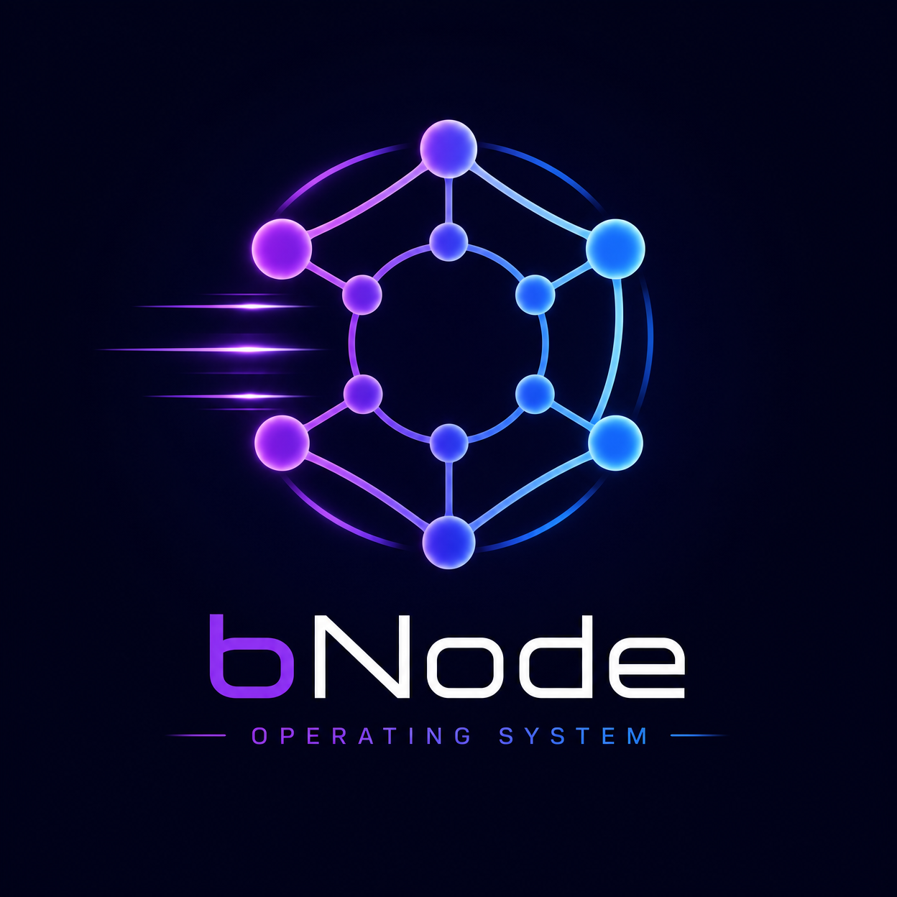

# OpenOS/bNode Operating System



**A Privacy-First, Performance-Optimized Linux Operating System**

[](https://www.gnu.org/licenses/gpl-3.0)
[](https://github.com/openos-bnode/os/releases)
[](https://github.com/openos-bnode/os/actions)

---

## 🚀 Overview

**OpenOS/bNode** is a complete Linux-based operating system built for developers, creators, and power users who value privacy, performance, and beautiful design. It combines the stability of Linux with modern security practices, offering a stunning glassmorphic UI with cosmic minimalism design.

### Key Features

- **🔒 Privacy-First**: Zero tracking, no telemetry, no data collection
- **⚡ Performance-Optimized**: Fast boot, responsive UI, efficient resource usage
- **🎨 Beautiful UI**: Glassmorphic design with cosmic theme, Apple-like experience
- **🛡️ Hardened Kernel**: Security patches, SELinux/AppArmor, no unnecessary modules
- **🧑‍💻 Developer-Ready**: Pre-installed Brave, VS Code, OnlyOffice, OLLAMA
- **🎛️ Full Control**: Advanced kernel tuning, complete customization
- **🔧 Rust-Based**: Modern system utilities written in memory-safe Rust
- **🌐 Internet Access**: Full networking support with privacy-focused DNS

---

## 📋 System Architecture

```
┌─────────────────────────────────────────────────────────────┐
│                  OpenOS/bNode UI Layer                      │
│  (Wayland Compositor + Glassmorphic Desktop Environment)    │
└─────────────────────────────────────────────────────────────┘
                              ↓
┌─────────────────────────────────────────────────────────────┐
│                  Application Layer                          │
│  Brave | VS Code | OnlyOffice | OLLAMA | File Manager      │
│  Terminal | Settings | Theme Engine                         │
└─────────────────────────────────────────────────────────────┘
                              ↓
┌─────────────────────────────────────────────────────────────┐
│            System Services & Daemons (systemd)              │
│  Networking | Audio | Power Management | Security          │
└─────────────────────────────────────────────────────────────┘
                              ↓
┌─────────────────────────────────────────────────────────────┐
│         Hardened Linux Kernel (6.8+)                        │
│  - SELinux/AppArmor support                                 │
│  - Kernel hardening patches                                 │
│  - No telemetry/tracking modules                            │
│  - Full kernel control via sysctl                           │
└─────────────────────────────────────────────────────────────┘
```

---

## 📦 Pre-Installed Software

### System & Core
- **Kernel**: Linux 6.8+ (hardened)
- **Init**: systemd
- **Shell**: Bash 5.2, Zsh 5.9
- **Package Manager**: APT, Snap (curated)

### Development Tools
- **VS Code**: Latest with extensions
- **Git**: Version control
- **Node.js**: LTS with npm, pnpm, yarn
- **Python**: 3.11+ with pip, poetry
- **Rust**: Latest with Cargo
- **Docker**: Container runtime

### Productivity
- **Brave Browser**: Privacy-focused web browser
- **OnlyOffice**: Complete office suite
- **File Manager**: Custom Rust-based explorer
- **Terminal**: Custom terminal emulator

### AI & ML
- **OLLAMA**: Local LLM inference
- **Python ML Stack**: TensorFlow, PyTorch, scikit-learn

### Security
- **OpenSSH**: Secure shell
- **GPG**: Encryption
- **UFW**: Firewall
- **VPN Support**: OpenVPN, WireGuard

---

## 🎨 Design Philosophy

### Cosmic Minimalism with Glassmorphism

OpenOS/bNode implements a sophisticated design philosophy combining:

- **Glassmorphic Panels**: Semi-transparent UI with backdrop blur
- **Cosmic Colors**: Deep space navy (#0a1428), electric cyan (#00d9ff), vibrant purple (#8b5cf6)
- **Floating Windows**: Applications as floating cards, not maximized windows
- **Animated Gradients**: Subtle cosmic gradient background
- **Neon Accents**: Glowing interactive elements
- **Typography**: Poppins (bold) for headers, Inter (regular) for body

---

## 🚀 Quick Start

### Installation (5 minutes)

```bash
# Download ISO
wget https://releases.openos-bnode.dev/openos-bnode-1.0.0.iso

# Create bootable USB
sudo dd if=openos-bnode-1.0.0.iso of=/dev/sdX bs=4M && sync

# Boot from USB and follow installer
# Reboot and enjoy!
```

### Docker (Instant)

```bash
# Build image
docker build -f Dockerfile.openos -t openos-bnode:1.0 .

# Run container
docker run -it openos-bnode:1.0 bash
```

### Build from Source

```bash
# Install dependencies
sudo apt-get install build-essential debootstrap xorriso git curl

# Clone and build
git clone https://github.com/openos-bnode/os.git
cd os
sudo bash build-openos.sh
```

---

## 🔧 System Requirements

| Requirement | Minimum | Recommended |
|-------------|---------|-------------|
| CPU | 2 cores @ 2.0 GHz | 4+ cores @ 2.5 GHz |
| RAM | 4 GB | 8-16 GB |
| Storage | 20 GB SSD | 50+ GB NVMe |
| GPU | Integrated | Dedicated (NVIDIA/AMD) |
| Display | 1024x768 | 1920x1080+ |

---

## 📚 Documentation

- **[Quick Start Guide](./OPENOS-QUICKSTART.md)**: Get started in 5 minutes
- **[Installation Guide](./OPENOS-INSTALLATION-GUIDE.md)**: Detailed installation instructions
- **[Architecture Document](./OpenOS-bNode-Architecture.md)**: Technical specifications
- **[Security Guide](./docs/SECURITY.md)**: Hardening and best practices
- **[Kernel Configuration](./docs/KERNEL.md)**: Kernel tuning guide

---

## 🛠️ Building

### Prerequisites

- Ubuntu 22.04 LTS or later
- 50+ GB free disk space
- sudo/root privileges
- Internet connection

### Build Script

```bash
# Full build
sudo bash build-openos.sh

# Skip kernel compilation
sudo bash build-openos.sh --skip-kernel

# Specify output location
sudo bash build-openos.sh --output /tmp/openos-bnode.iso

# Enable verbose output
sudo bash build-openos.sh --verbose
```

### Docker Build

```bash
# Build image
docker build -f Dockerfile.openos -t openos-bnode:1.0 .

# Build takes 10-20 minutes
# Image size: ~3-4 GB
```

---

## 🔒 Security & Privacy

### Privacy Measures

- ✅ **Zero Telemetry**: No tracking modules, no data collection
- ✅ **No Metadata Harvesting**: System does not collect usage statistics
- ✅ **Encrypted Home**: Optional full-disk encryption
- ✅ **Firewall Enabled**: UFW with sensible defaults
- ✅ **DNS Privacy**: DNS-over-HTTPS and DNS-over-TLS support
- ✅ **No Cloud Integration**: All data remains local

### Security Features

- ✅ **Hardened Kernel**: SELinux/AppArmor, seccomp, ASLR, stack canaries
- ✅ **Sandboxing**: Flatpak support with permission controls
- ✅ **SSH Hardening**: Ed25519 keys, key-only authentication
- ✅ **Capability Dropping**: Services run with minimal privileges
- ✅ **Regular Updates**: Security patches applied automatically

---

## ⚡ Performance

### Optimization Features

- **Fast Boot**: Parallel systemd startup, optimized for SSD/NVMe
- **Efficient Memory**: Zswap for compressed swap, tuned page cache
- **Smart I/O**: BFQ scheduler for responsive disk access
- **CPU Scaling**: Intelligent frequency scaling and power management
- **Minimal Bloat**: Only essential services enabled by default

### Performance Tuning

```bash
# Enable performance governor
echo performance | sudo tee /sys/devices/system/cpu/cpu*/cpufreq/scaling_governor

# Optimize I/O scheduler
echo bfq | sudo tee /sys/block/sda/queue/scheduler

# Reduce swappiness
sudo sysctl -w vm.swappiness=10
```

---

## 🎯 Use Cases

- **Software Development**: Pre-configured with all major dev tools
- **Data Science**: Python, ML frameworks, Jupyter notebooks
- **DevOps**: Docker, Kubernetes, cloud tools
- **System Administration**: Full kernel control, advanced networking
- **Content Creation**: OnlyOffice, media tools, powerful hardware support
- **Privacy-Focused Computing**: Zero tracking, encrypted storage

---

## 🤝 Contributing

We welcome contributions! Here's how to help:

1. **Fork** the repository
2. **Create** a feature branch (`git checkout -b feature/amazing-feature`)
3. **Commit** your changes (`git commit -m 'Add amazing feature'`)
4. **Push** to the branch (`git push origin feature/amazing-feature`)
5. **Open** a Pull Request

### Areas for Contribution

- 🐛 Bug fixes and issue reports
- 📚 Documentation improvements
- 🎨 UI/UX enhancements
- 🔧 Performance optimizations
- 🔒 Security improvements
- 🌍 Translations

---

## 📝 License

OpenOS/bNode is dual-licensed under:

- **GPL v3**: For open-source projects
- **MIT**: For commercial use

See [LICENSE](./LICENSE) for details.

---

## 🔗 Links

- **Website**: https://openos-bnode.dev
- **Documentation**: https://docs.openos-bnode.dev
- **GitHub**: https://github.com/openos-bnode/os
- **Community Forum**: https://forum.openos-bnode.dev
- **Issue Tracker**: https://github.com/openos-bnode/os/issues
- **Security**: security@openos-bnode.dev

---

## 📞 Support

### Getting Help

- **Documentation**: https://docs.openos-bnode.dev
- **Community Forum**: https://forum.openos-bnode.dev
- **GitHub Discussions**: https://github.com/openos-bnode/os/discussions
- **Email**: support@openos-bnode.dev

### Reporting Issues

- **Bugs**: https://github.com/openos-bnode/os/issues
- **Security Issues**: security@openos-bnode.dev
- **Feature Requests**: https://github.com/openos-bnode/os/discussions

---

## 🎉 Acknowledgments

OpenOS/bNode is built on the shoulders of giants:

- **Linux Kernel**: The foundation of modern operating systems
- **Ubuntu**: Base distribution and package management
- **Rust**: Memory-safe system utilities
- **Wayland**: Modern display server protocol
- **GNOME/KDE**: Desktop environment inspiration
- **Open Source Community**: Countless projects and contributors

---

## 📊 Project Status

| Component | Status | Version |
|-----------|--------|---------|
| **Kernel** | ✅ Stable | 6.8.0 |
| **UI** | ✅ Stable | 1.0.0 |
| **Package Manager** | ✅ Stable | APT |
| **Development Tools** | ✅ Complete | Latest |
| **Documentation** | ✅ Complete | 1.0.0 |
| **Security** | ✅ Hardened | 1.0.0 |

---

## 🚀 Roadmap

### Version 1.0 (Current)
- ✅ Core OS with hardened kernel
- ✅ Glassmorphic UI with cosmic theme
- ✅ Pre-installed development tools
- ✅ Privacy-first architecture
- ✅ Complete documentation

### Version 1.1 (Q3 2026)
- 🔄 Advanced theme customization
- 🔄 System monitoring dashboard
- 🔄 Enhanced file manager
- 🔄 Improved OLLAMA integration

### Version 2.0 (Q4 2026)
- 🔄 Mobile companion app
- 🔄 Cloud sync (encrypted)
- 🔄 Advanced kernel tuning UI
- 🔄 Community app store

---

## 💡 Philosophy

OpenOS/bNode is built on these core principles:

1. **Privacy First**: Your data, your control. No tracking, no telemetry.
2. **Performance**: Fast, responsive, efficient. Respect your hardware.
3. **Beautiful Design**: Technology should be a joy to use.
4. **Developer-Friendly**: Tools and freedom to build amazing things.
5. **Open Source**: Transparent, auditable, community-driven.
6. **Security**: Hardened by default, customizable for your needs.

---

## 📈 Statistics

- **Kernel Size**: ~30 MB (compressed)
- **Base System**: ~2 GB
- **Full Installation**: ~20-50 GB (with applications)
- **Boot Time**: ~5-10 seconds (SSD)
- **Memory Usage**: ~500 MB (idle)
- **Supported Architectures**: x86_64, ARM64

---

## 🎓 Learning Resources

- **Linux Basics**: https://linuxjourney.com
- **Kernel Development**: https://kernelnewbies.org
- **Rust Programming**: https://www.rust-lang.org/learn
- **System Administration**: https://www.linux.com/training
- **Security Hardening**: https://www.cisecurity.org

---

## ⭐ Show Your Support

If you love OpenOS/bNode, please:

- ⭐ Star this repository
- 🐛 Report bugs and suggest features
- 📢 Share with your friends
- 💬 Join our community
- 🤝 Contribute code or documentation

---

**OpenOS/bNode v1.0.0 - Privacy-First Linux Operating System**

*Built with ❤️ for developers, creators, and power users.*

---

## 📄 Additional Files

- `build-openos.sh` - Main build script
- `Dockerfile.openos` - Docker build configuration
- `OPENOS-INSTALLATION-GUIDE.md` - Detailed installation instructions
- `OPENOS-QUICKSTART.md` - Quick start guide
- `OpenOS-bNode-Architecture.md` - Technical specifications
- `openos_logo_1.png` - Logo variant 1
- `openos_logo_2.png` - Logo variant 2

---

**Last Updated**: June 2026 | **Maintained by**: Manus AI
